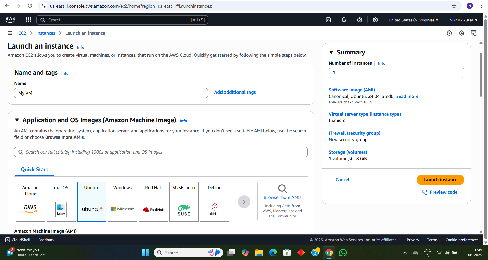
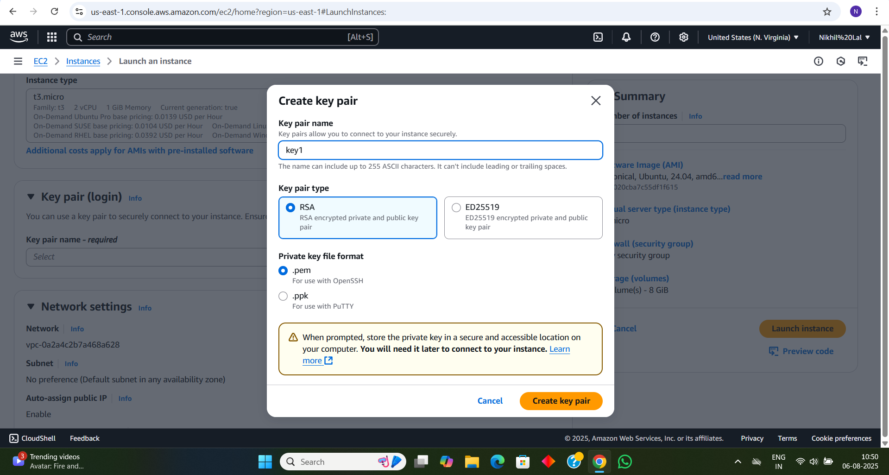
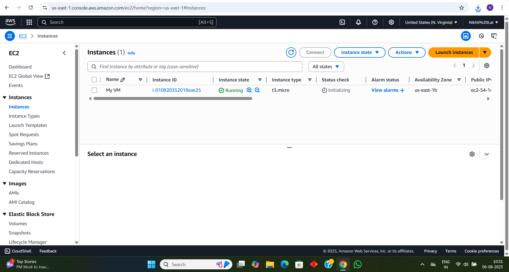

# 📅 Day 2 - Virtualization and EC2 Setup on AWS

## 🔍 What I Learned

### 🔧 What is Virtualization?
- Virtualization allows running multiple virtual machines (VMs) on a single physical machine.
- It uses a software layer called a **hypervisor**.
- Benefits:
  - Better hardware utilization
  - Isolation between systems
  - Easy testing and development

### 🛠️ Types of Virtualization
- **Hardware Virtualization**: VMs via VirtualBox, VMware
- **Operating System Virtualization**: Containers (e.g., Docker)
- **Storage / Network / Desktop** virtualization

### 🧰 Hypervisor Types
| Type | Examples |
|------|----------|
| Type 1 (Bare Metal) | VMware ESXi, Microsoft Hyper-V |
| Type 2 (Hosted)     | Oracle VirtualBox, VMware Workstation |

---

## ☁️ Hands-On: EC2 on AWS (Free Tier)

I created a virtual machine on the cloud using AWS EC2.

### ✔️ Steps I Followed:
1. Signed up for AWS Free Tier
2. Launched a t2.micro EC2 instance (Ubuntu)
3. Created a Key Pair (`.pem`) to connect securely
4. Configured Security Group (allowed SSH - port 22)
5. Connected via MobaXterm using SSH

---

## 📸 Screenshots

> Screenshots are stored in `Day-2-Virtualization/screenshots/`

- Launch EC2 instance  
  

- Create Key Pair  
  

- Instance Ready  
  

- SSH Connection  
  

---

## 🧠 Summary

- Understood the concept of virtualization and hypervisors
- Got hands-on experience with cloud-based VMs using AWS
- Successfully launched and connected to a virtual machine on AWS

📌 Looking forward to exploring more Linux basics and automation tools next!
