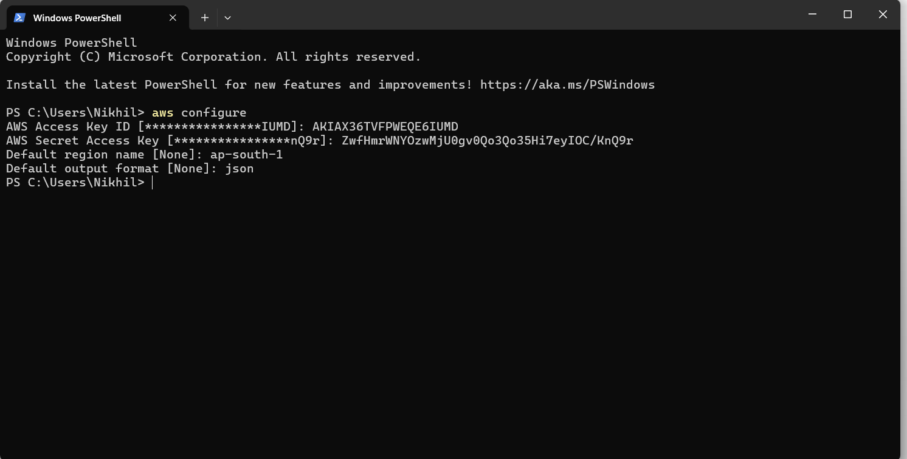
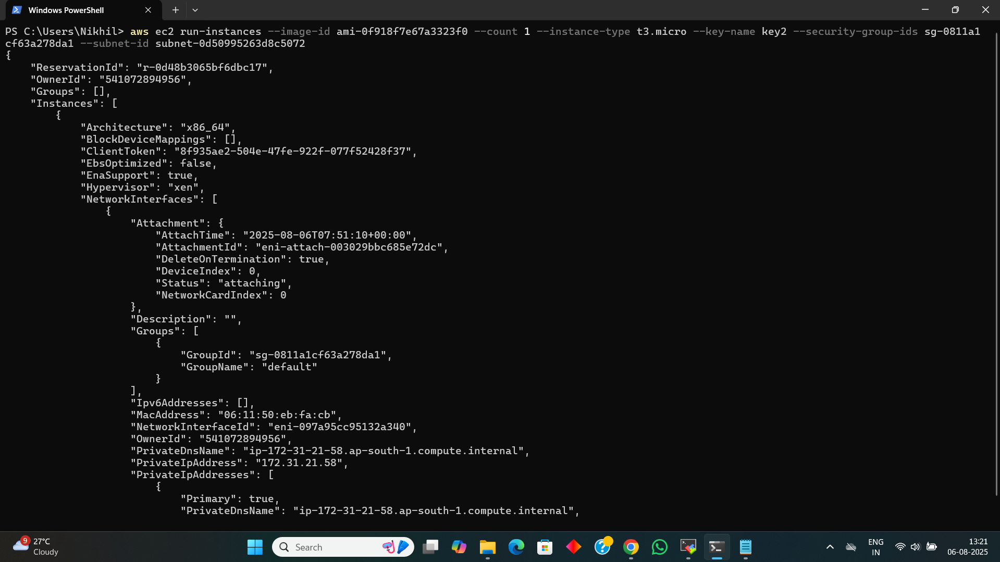
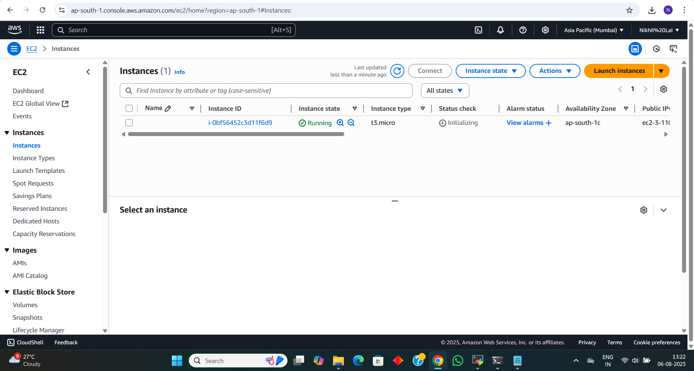
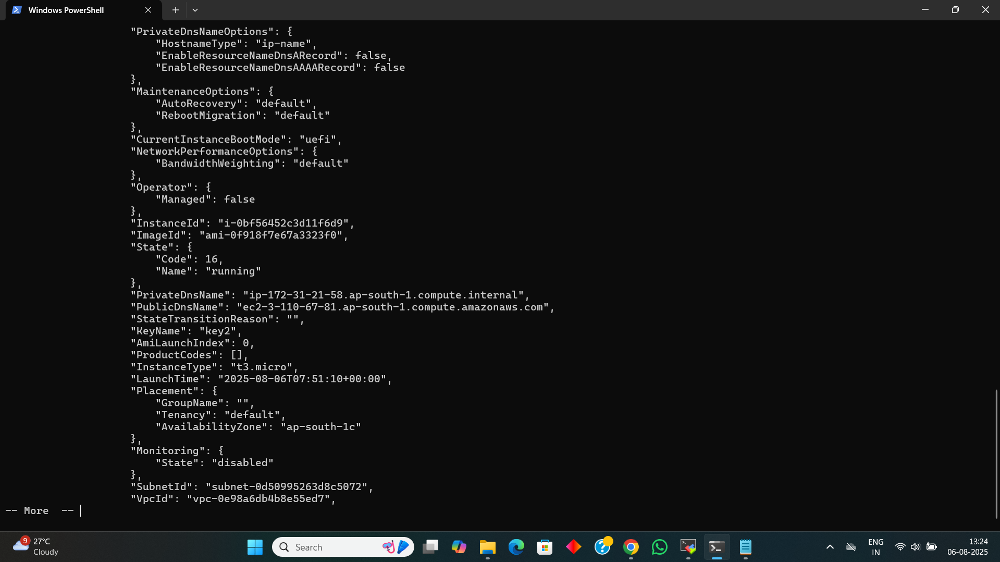
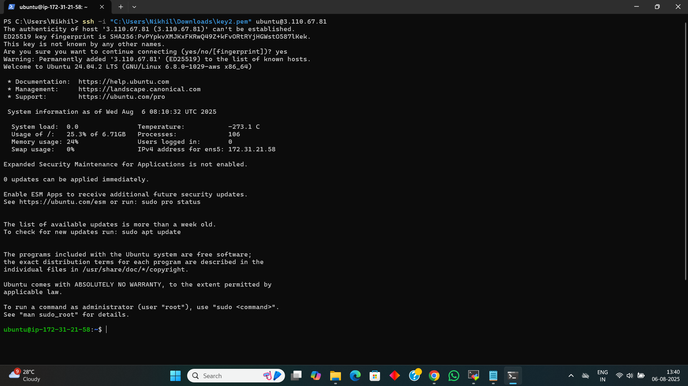

# 📅 Day 2 - Part 2: EC2 Instance Access via SSH & AWS CLI

---

## 🔐 Connecting to EC2 Using SSH (Manual Method)

After launching an EC2 instance from the AWS Console:

### Steps:
1. Downloaded the `.pem` key file (used for authentication)
2. Changed the file permission to secure it:
   ```bash
   chmod 400 my-key.pem
   ```
3. Connected using SSH from terminal:
   ```bash
   ssh -i my-key.pem ubuntu@<your-ec2-public-ip>
   ```

📌 The default username for Ubuntu AMIs is `ubuntu`.

✅ Once connected, I explored the instance using basic Linux commands:
```bash
uname -a
uptime
ls -l
```

---

## 🛠️ Setting Up AWS CLI

### Step 1: Configured AWS CLI
```bash
aws configure
```
- Entered `Access Key ID`, `Secret Access Key`, `Region`, and `Output format`.

---

## ☁️ Launching EC2 Instance Using AWS CLI

### Step 2: Launched an Instance with Command:
```bash
aws ec2 run-instances \
    --image-id ami-xxxxxxxxxxxxxxxxx \
    --count 1 \
    --instance-type t2.micro \
    --key-name my-key-pair \
    --security-group-ids sg-xxxxxxxxxxx \
    --subnet-id subnet-xxxxxxxxxxx
```

📌 Replace values like:
- `ami-id` with a valid Ubuntu AMI ID for your region  
- `sg-id` and `subnet-id` from your AWS Console

---

## 🔍 Step 3: Get Instance Info

```bash
aws ec2 describe-instances
```

- Used to fetch `Instance ID`, `Public IP`, and `Status`.

---

## 📸 Screenshots

> These are added in the `screenshots/` folder

- AWS CLI Configure  
  

- EC2 Launch Command via CLI  
  

- EC2 created
  

- Describe Instance Output  
  

- SSH Access Confirmation  
  

---

## ✅ Summary

- Learned how to securely connect to EC2 via SSH using `.pem` file
- Configured AWS CLI for programmatic access
- Launched a new EC2 instance using CLI (not the web UI)
- Retrieved and inspected instance info using AWS CLI commands
